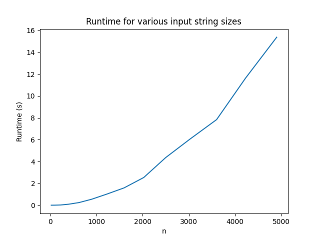

# COP4533_Programming_Assignment_3

Christopher Bowers

UFID: 19272960

Dylan Esperto

UFID: 53118184

## Instructions to Run

Run this command from the repository root to run the algorithm:
```
python ./src/main.py
```

To test with example data, run this command:
```
cat data/ex1.in | python ./src/main.py
```

## Question 1: Runtime Graph

As the size of both input strings grow, a clear polynomial runtime pattern shows for larger n. 



## Question 2: Recurrence Equation

OPT(i, j) represents the maximum value of a common subsequence of the first i 
characters of A and the first j characters of B, where v(c) represents value of a given character c.


OPT(i, j) = 0 <span style="float:right;">if i = 0 or j = 0</span>

OPT(i, j) = max(OPT(i-1,j-1) + v(A[i]), OPT(i-1,j), OPT(i,j-1)) <span style="float:right;">if A[i] = B[j]</span>

OPT(i, j) = max(OPT(i-1,j), OPT(i,j-1)) <span style="float:right;">if A[i] ≠ B[j]</span>

The answer is OPT(m, n) where m and n are the lengths of A and B respectively.

**Base cases:** When either string is empty there are no characters to match, 
so the maximum value is 0.

**Match case:** When A[i] = B[j] we consider three options: take the matching 
character and add its value to the best solution for the remaining prefixes 
OPT(i-1,j-1), skip character i in A, or skip character j in B. We take the max 
over all three because taking a match is an opportunity, not an obligation — a 
zero-value match adds nothing and should be skipped.

**No match case:** When A[i] ≠ B[j] we cannot take both characters, so we take 
the best of skipping i in A or skipping j in B.
